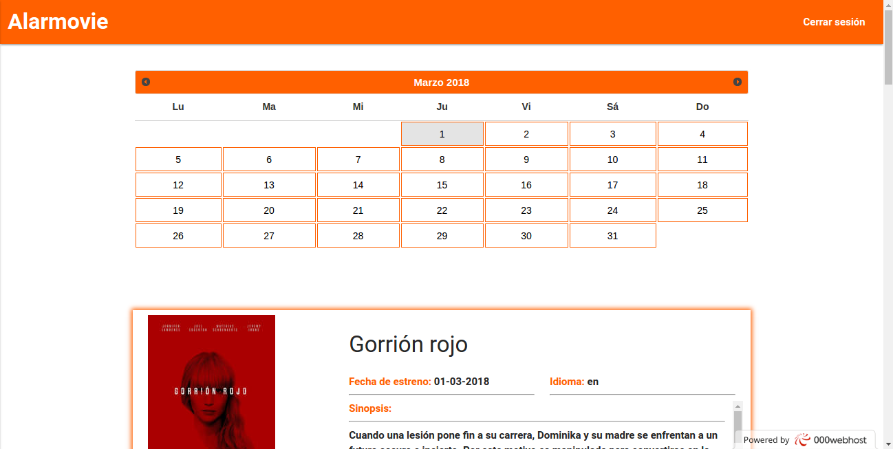
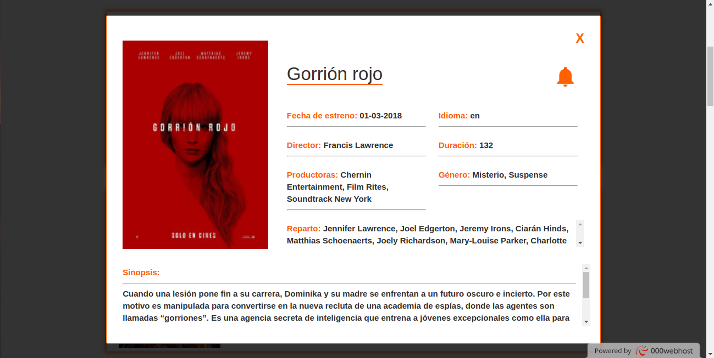
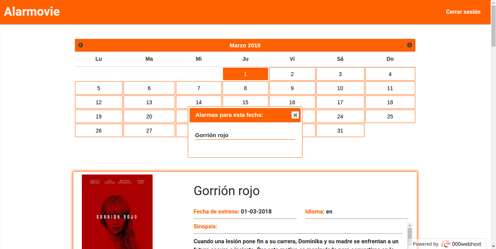

# Alarmovie
## La web que te avisará de los estrenos

### Instalación
#### 1- Utilice XAMPP para conectarse a MySQL y APACHE.
#### 2- Cree una base de datos local llamada alarmovie con usuario: root y sin contraseña.
#### 3- Importe en su base de datos, el archivo sql que se encuentra en la carpeta sql.
#### 4- Introduzca en la carpeta htdocs la carpeta Alarmovie.
#### 5- ¡Listo!, ya puede entrar desde localhost/Alarmovie/index.php.

### O si lo prefiere, puede entrar desde internet en [Alarmovie](https://betalarmovie.000webhostapp.com/main.php).

## Alarmovie aún está en construcción, por lo tanto, solo tendrá algunas funcionalidades básicas.
#### - Por ejemplo; la página principal, dispondrá de un calendario el cual mostrará las fechas coloreadas que tengan una alarma de algún estreno asociada. Las alarmas se activan pulsando en alguna película (se abrirá una ventana con toda la información de la película que haya actualmente) y a continuación, en el icono de la campana. Hecho esto se podrá comprobar que el calendario ya tiene fechas resaltadas, las cuales nos mostrarán en una ventana si pulsamos en la celda de la fecha, todos los estrenos asociados a esa fecha.

## Algunas capturas de la aplicación

